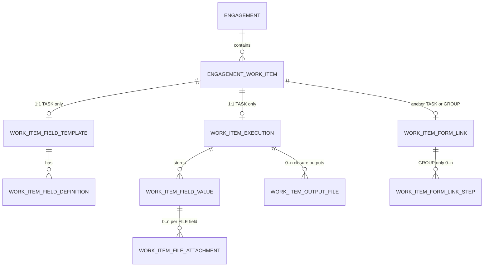

# Backend instructions: engagement work items (groups, tasks, fields, closure)

This document describes what to build **after** the existing engagement work-item tree (groups + tasks). It matches the current Next.js UI under customer engagement → **Work** tab (`EngagementWorkPanel`, `TaskWorkCard`, field builder, closure flow).

**Frontend types to mirror:** `src/api/types/template-config.ts` (`EngagementWorkItemResponse`, `WorkItemStatus`) and `src/api/types/work-item-template.ts` (`WorkItemFieldDefinition`, `WorkItemFieldValue`, `WorkItemExecutionDto`).

---

## 1. What you already have (baseline)

When an engagement is created from a service catalog, the backend materializes a **flat list** of work items. The UI builds a tree with `parentId` + `nodeType`:

| `nodeType` | UI role | `parentId` |
|------------|---------|------------|
| `GROUP`    | Section (Roman numeral heading) | `null` or another group |
| `TASK`     | Action card with fields / status | Parent group id (or root) |

**Example engagement fragment (existing API):**

```http
GET /api/companies/{companyId}/engagements/{engagementId}
```

```json
{
  "id": "eng_01HXYZ",
  "customerId": "cust_abc",
  "catalogId": "cat_payroll",
  "title": "Payroll Q1 2026",
  "status": "ACTIVE",
  "workItems": [
    {
      "id": "wi_group_1",
      "engagementId": "eng_01HXYZ",
      "parentId": null,
      "catalogNodeId": "node_grp_onboarding",
      "nodeType": "GROUP",
      "name": "Onboarding",
      "sortOrder": 0,
      "treeDepth": 0,
      "status": "PENDING",
      "active": true
    },
    {
      "id": "wi_task_1",
      "engagementId": "eng_01HXYZ",
      "parentId": "wi_group_1",
      "catalogNodeId": "node_task_collect_docs",
      "nodeType": "TASK",
      "name": "Collect supporting documents",
      "sortOrder": 0,
      "treeDepth": 1,
      "status": "PENDING",
      "active": true
    }
  ]
}
```

**Rules:**

| Resource | Attached to |
|----------|-------------|
| Field template, field values, execution, closure, files | **`TASK`** work items only |
| Shareable form link | **`TASK`** or **`GROUP`** (see §3 link creation, §5.7 CRUD, §6 public GET) |

- **TASK link** → public page shows **one** form.
- **GROUP link** → public page shows **all tasks under that group** as tabs / stepper steps (backend returns ordered `steps[]`; frontend renders navigation).



---

## 2. New tables (suggested)

Use your DB naming convention; column names below are logical.

### 2.1 `work_item_field_template`

One row per **TASK** work item once staff clicks “Choose fields to capture”.

| Column | Type | Notes |
|--------|------|--------|
| `id` | UUID PK | |
| `company_id` | UUID FK | Tenant scope |
| `engagement_id` | UUID FK | Denormalized for queries |
| `work_item_id` | UUID FK **UNIQUE** → `engagement_work_item.id` | Must be `TASK` |
| `version` | INT | Increment on each template replace |
| `configured_at` | TIMESTAMPTZ | |
| `configured_by_user_id` | UUID nullable | Staff who saved builder |
| `created_at`, `updated_at` | TIMESTAMPTZ | |

### 2.2 `work_item_field_definition`

Rows mirror `WorkItemFieldDefinition` from the UI builder.

| Column | Type | Notes |
|--------|------|--------|
| `id` | UUID PK | Stable id; frontend sends on save |
| `template_id` | UUID FK | |
| `label` | VARCHAR | |
| `widget` | VARCHAR | `TEXT`, `NUMBER`, `DATE`, `TEXTAREA`, `FILE`, `CHECKBOX`, `SELECT`, `CUSTOMER_LINK`, `TABLE` |
| `required` | BOOLEAN | |
| `sort_order` | INT | |
| `allow_multiple` | BOOLEAN | FILE only |
| `customer_field_key` | VARCHAR nullable | `tin`, `name`, … for `CUSTOMER_LINK` |
| `options_json` | JSONB nullable | `[{ "value": "opt_0", "label": "Yes" }]` for SELECT |
| `table_columns_json` | JSONB nullable | `[{ "id": "col_1", "label": "Description" }]` for TABLE (future UI) |
| `active` | BOOLEAN | Soft-disable without deleting history |

**TABLE values (future):** store in `work_item_field_value.value_json` as:

```json
{
  "rows": [
    { "col_1": "Line 1", "col_2": "1000" },
    { "col_1": "Line 2", "col_2": "500" }
  ]
}
```

### 2.3 `work_item_execution`

One row per TASK: status override, draft vs submitted responses, closure.

| Column | Type | Notes |
|--------|------|--------|
| `id` | UUID PK | |
| `company_id`, `engagement_id`, `work_item_id` | UUID | `work_item_id` **UNIQUE** |
| `status` | VARCHAR | `PENDING`, `IN_PROGRESS`, `DONE`, `BLOCKED`, `NOT_APPLICABLE` — same enum as catalog work item |
| `values_saved_at` | TIMESTAMPTZ nullable | Last “Save responses” (in-progress capture) |
| `responses_locked` | BOOLEAN default false | True after closure submit OR explicit lock |
| `closure_status` | VARCHAR nullable | Copy of status when closed: `DONE`, `BLOCKED`, `NOT_APPLICABLE` |
| `closure_remark` | TEXT nullable | Final remark |
| `closure_submitted_at` | TIMESTAMPTZ nullable | Locks UI summary |
| `closure_submitted_by_user_id` | UUID nullable | |
| `allow_reopen` | BOOLEAN default true | Staff “Edit closure” sets execution back to editable |
| `created_at`, `updated_at` | TIMESTAMPTZ | |

> **Merge with existing `engagement_work_item.status`:** Either (A) make `work_item_execution.status` the source of truth and expose it on `EngagementWorkItemResponse.status`, or (B) PATCH work item row directly. Frontend today overrides status in localStorage — prefer **single column** on `engagement_work_item` updated via API so list + detail stay consistent.

### 2.4 `work_item_field_value`

Normalized storage for answers (internal staff save + public link submit).

| Column | Type | Notes |
|--------|------|--------|
| `id` | UUID PK | |
| `execution_id` | UUID FK | |
| `field_definition_id` | UUID FK | |
| `value_text` | TEXT nullable | TEXT, NUMBER, TEXTAREA, SELECT, CUSTOMER_LINK |
| `value_bool` | BOOLEAN nullable | CHECKBOX |
| `value_date` | DATE nullable | DATE |
| `value_json` | JSONB nullable | TABLE rows, complex widgets |
| `source` | VARCHAR | `INTERNAL` \| `PUBLIC_LINK` |
| `submitted_at` | TIMESTAMPTZ | |
| UNIQUE (`execution_id`, `field_definition_id`) | | Upsert on save |

### 2.5 `work_item_file_attachment`

Do **not** store base64 in Postgres long-term (UI does today for mock).

| Column | Type | Notes |
|--------|------|--------|
| `id` | UUID PK | |
| `field_value_id` | UUID FK | Parent FILE field value |
| `storage_key` | VARCHAR | S3 / blob path |
| `file_name` | VARCHAR | |
| `mime_type` | VARCHAR | |
| `size_bytes` | BIGINT | |
| `uploaded_at` | TIMESTAMPTZ | |

API returns URLs:

```json
{ "id": "file_1", "name": "invoice.pdf", "mimeType": "application/pdf", "size": 120400, "url": "https://..." }
```

### 2.6 `work_item_output_file`

**Closure / deliverable** files (separate from FILE fields in the template — “output” the user uploads when closing).

| Column | Type | Notes |
|--------|------|--------|
| `id` | UUID PK | |
| `execution_id` | UUID FK | |
| `storage_key`, `file_name`, `mime_type`, `size_bytes` | | |
| `uploaded_by_user_id` | UUID | |
| `uploaded_at` | TIMESTAMPTZ | |

### 2.7 `work_item_form_link`

Shareable customer form. **One link row per anchor work item** (TASK or GROUP).

| Column | Type | Notes |
|--------|------|--------|
| `id` | UUID PK | |
| `company_id`, `engagement_id` | UUID FK | Denormalized |
| `anchor_work_item_id` | UUID FK **UNIQUE** → `engagement_work_item.id` | TASK **or** GROUP |
| `link_scope` | VARCHAR | `TASK` \| `GROUP` — must match anchor `node_type` |
| `public_token` | VARCHAR **UNIQUE** | Unguessable (32+ chars) |
| `edited` | BOOLEAN default **false** | Scope depends on link type — see §4 |
| `enabled` | BOOLEAN default true | Staff can disable without delete |
| `expires_at` | TIMESTAMPTZ nullable | Optional |
| `first_opened_at` | TIMESTAMPTZ nullable | Set on first public GET |
| `last_opened_at` | TIMESTAMPTZ nullable | Updated every public GET |
| `last_submitted_at` | TIMESTAMPTZ nullable | Last successful public submit (any step) |
| `created_at`, `updated_at` | TIMESTAMPTZ | |
| `created_by_user_id` | UUID nullable | Staff who created link |

**GROUP links do not duplicate task data.** Backend resolves child TASKs at read time:

```sql
-- Pseudocode: tasks included in a GROUP link
SELECT * FROM engagement_work_item
WHERE engagement_id = :engagementId
  AND node_type = 'TASK'
  AND parent_id = :anchorGroupId   -- direct children only
  AND active = true
ORDER BY sort_order ASC;
```

If your catalog nests tasks deeper than one level, either flatten into the group link or document that only **direct child TASKs** appear in the stepper (recommended for v1).

### 2.8 `work_item_form_link_step` (optional cache, GROUP links)

Optional table if you want per-step `edited` without joining executions:

| Column | Type | Notes |
|--------|------|--------|
| `id` | UUID PK | |
| `form_link_id` | UUID FK | |
| `task_work_item_id` | UUID FK | Child TASK |
| `sort_order` | INT | Same as task `sort_order` |
| `edited` | BOOLEAN default false | Locked after customer submits **this** step |
| `last_submitted_at` | TIMESTAMPTZ nullable | |

**Alternative (simpler v1):** No step table — derive each step’s `edited` from `work_item_execution.responses_locked` or a `public_submitted_at` on execution. GROUP link’s top-level `edited` is `true` only when **all** included tasks are locked/submitted.

---

## 3. Form link creation — who can create, when, TASK vs GROUP

### 3.1 Staff-side link creation (admin engagement UI)

Links are **not** auto-created only from saving a field template. Staff explicitly creates or regenerates a link (or you auto-create on first template save — pick one policy; below assumes **explicit create** with optional auto-create on template save).

| Anchor | `link_scope` | URL pattern (frontend) | Public UX |
|--------|--------------|------------------------|-----------|
| TASK `wi_task_1` | `TASK` | `{APP_URL}/forms/{publicToken}` | Single form for that task |
| GROUP `wi_group_1` | `GROUP` | `{APP_URL}/forms/{publicToken}` | **Stepper / tabs** — one step per child TASK that has a configured template |

**Create link (staff):**

```http
POST /api/companies/{companyId}/engagements/{engagementId}/work-items/{workItemId}/form-link
```

Body (optional):

```json
{
  "regenerateToken": false,
  "expiresAt": "2026-12-31T23:59:59Z"
}
```

**Logic:**

1. Load `workItemId`; verify `engagementId` + `companyId`.
2. If `nodeType === TASK`:
   - Set `link_scope = TASK`, `anchor_work_item_id = workItemId`.
   - Require at least one field in `work_item_field_template` (or allow link creation with warning if template empty — product choice; **recommended:** `400 TEMPLATE_NOT_CONFIGURED` if no fields).
3. If `nodeType === GROUP`:
   - Set `link_scope = GROUP`.
   - Resolve child TASKs (`parent_id = workItemId`).
   - Require **≥ 1 child TASK** with a configured template (others can appear as disabled steps: `configured: false`).
4. If link already exists and `regenerateToken: true` → new `public_token`, old URL stops working.
5. If link exists and `regenerateToken: false` → return existing link (`200` or `409` with existing body — your choice).
6. Default: `edited = false`, `enabled = true`.

**Response:**

```json
{
  "id": "link_abc",
  "anchorWorkItemId": "wi_group_1",
  "linkScope": "GROUP",
  "publicToken": "7Qk9mN2pR8sT4vX1",
  "url": "https://app.example.com/forms/7Qk9mN2pR8sT4vX1",
  "edited": false,
  "enabled": true,
  "expiresAt": null,
  "includedTaskIds": ["wi_task_1", "wi_task_2"],
  "createdAt": "2026-05-16T10:00:00Z"
}
```

**Where staff sees the URL**

- On each **TASK** card: copy **task link** (if task link exists) or note “use group link”.
- On each **GROUP** header (new UI): “Share group form” → creates GROUP link covering all tasks in section.

Backend should expose link on:

- `GET .../work-items/{workItemId}/form-link`
- `GET .../work-items/{workItemId}/field-template` → embed `formLink` when present
- `GET .../work-items/{workItemId}/execution` → embed `formLink`

---

## 4. `edited` flag — TASK link vs GROUP link

### 4.1 TASK-scoped link

| State | `edited` | Who can fill |
|-------|----------|----------------|
| No template / no link | — | Staff configures in admin only |
| Link live, not submitted | `false` | Customer may open URL and submit |
| Customer submitted via link | `true` | Public form **read-only** until staff PATCH |
| Staff allows resubmit | `false` | Customer may submit again |

**On public POST submit (TASK):** `edited = true`, `last_submitted_at = now()`, set `work_item_execution.responses_locked = true` (and `source = PUBLIC_LINK` on values).

### 4.2 GROUP-scoped link (stepper)

Each **step** = one child TASK. Use per-task lock (recommended):

| Per-step | Field | Meaning |
|----------|-------|---------|
| Step not submitted | `steps[i].edited = false` | Customer can fill that tab |
| Step submitted | `steps[i].edited = true` | That tab read-only |
| All steps submitted | `edited = true` on link row | Whole wizard read-only |

**On public POST submit for one step:** set that task’s execution `responses_locked = true` and step `edited = true`. When every included task is submitted, set link-level `edited = true`.

**Partial progress:** Customer may save draft on a step without final submit (optional `PUT .../draft`) — drafts do **not** set `edited = true`.

### 4.3 Staff internal saves

`PUT field-values` from authenticated staff does **not** set link `edited = true` (recommended). Only **public submit** or **closure submit** locks customer access.

**Staff “Edit closure” / allow customer resubmit:** `PATCH form-link` with `{ "edited": false }` and optionally per-step `{ "taskWorkItemId": "...", "edited": false }`; clear `responses_locked` on affected executions.

---

## 5. Complete REST API reference (authenticated)

Base path:

`/api/companies/{companyId}/engagements/{engagementId}/work-items/{workItemId}/...`

**Validation**

- Work item belongs to engagement and company.
- Endpoints marked **(TASK only)** return `400 NOT_A_TASK` if `nodeType === GROUP`.
- Endpoints marked **(TASK or GROUP)** accept either; behavior depends on `nodeType`.

### 5.0 API matrix (do not skip DELETE / PATCH)

| Resource | GET | POST | PUT | PATCH | DELETE |
|----------|-----|------|-----|-------|--------|
| Work item status | — | — | — | ✓ §5.3 | — |
| Field template | ✓ §5.1 | — | ✓ §5.1 | ✓ §5.1 | ✓ §5.1 |
| Single field definition | — | ✓ §5.1 | — | ✓ §5.1 | ✓ §5.1 |
| Field values | ✓ §5.2 | — | ✓ §5.2 | ✓ §5.2 | ✓ §5.2 |
| Field file upload | — | ✓ §5.6 | — | — | ✓ §5.6 |
| Form link | ✓ §5.7 | ✓ §5.7 | — | ✓ §5.7 | ✓ §5.7 |
| Closure | ✓ §5.4 | ✓ §5.4 | — | ✓ §5.4 | ✓ §5.4 |
| Closure reopen | — | ✓ §5.4 | — | — | — |
| Output files | ✓ §5.5 | ✓ §5.5 | — | — | ✓ §5.5 |
| Execution bundle | ✓ §5.8 | — | — | — | — |

**Public (no auth)** — §6.

### 5.1 Field template (TASK only)

```http
GET    .../work-items/{workItemId}/field-template
PUT    .../work-items/{workItemId}/field-template      # replace all fields
PATCH  .../work-items/{workItemId}/field-template      # partial metadata (rare)
DELETE .../work-items/{workItemId}/field-template      # remove template + definitions

POST   .../work-items/{workItemId}/field-definitions   # add one field
PATCH  .../work-items/{workItemId}/field-definitions/{fieldId}
DELETE .../work-items/{workItemId}/field-definitions/{fieldId}
```

**PUT** — replace entire template (builder “Save”):

```json
{
  "fields": [
    {
      "id": "fld_8f2a",
      "label": "TIN",
      "widget": "TEXT",
      "required": true,
      "sortOrder": 0
    },
    {
      "id": "fld_9b1c",
      "label": "Supporting documents",
      "widget": "FILE",
      "required": false,
      "sortOrder": 1,
      "allowMultiple": true
    },
    {
      "id": "fld_link",
      "label": "Customer email",
      "widget": "CUSTOMER_LINK",
      "required": false,
      "sortOrder": 2,
      "customerFieldKey": "contactEmail"
    }
  ]
}
```

**GET response:**

```json
{
  "workItemId": "wi_task_1",
  "engagementId": "eng_01HXYZ",
  "configuredAt": "2026-05-16T10:00:00Z",
  "configuredByUserId": "usr_staff_1",
  "version": 2,
  "fields": [ "... same as PUT ..." ],
  "formLink": {
    "url": "https://app.example.com/forms/7Qk9mN2pR8sT4vX1",
    "publicToken": "7Qk9mN2pR8sT4vX1",
    "linkScope": "TASK",
    "edited": false,
    "enabled": true,
    "expiresAt": null
  }
}
```

**DELETE template** — remove template row, soft-delete or hard-delete definitions, clear field values for that task, **do not** delete `form_link` (staff may DELETE link separately). Return `204`.

**PATCH template** (optional) — e.g. reorder only:

```json
{ "fields": [{ "id": "fld_8f2a", "sortOrder": 1 }] }
```

**POST field-definition** — add one field without replacing others; bump `version`.

**PATCH field-definition** — update label, widget, required, options.

**DELETE field-definition** — remove field; orphan values for that `fieldId` should be deleted.

**Side effects on PUT:** bump `version`, replace definitions (transaction). Does **not** auto-create form link (use POST `form-link`). If link exists and template changes materially, consider resetting link `edited=false` only when staff confirms.

---

### 5.2 Field values (TASK only — staff capture)

```http
GET    .../work-items/{workItemId}/field-values
PUT    .../work-items/{workItemId}/field-values       # full replace
PATCH  .../work-items/{workItemId}/field-values       # merge one or more fields
DELETE .../work-items/{workItemId}/field-values       # clear all answers (not template)
```

**PUT request:**

```json
{
  "values": [
    { "fieldId": "fld_8f2a", "value": "123456789" },
    {
      "fieldId": "fld_9b1c",
      "attachments": [
        {
          "id": "file_tmp_1",
          "name": "doc.pdf",
          "mimeType": "application/pdf",
          "size": 45000,
          "url": "https://cdn.example.com/..."
        }
      ]
    }
  ]
}
```

**GET response:**

```json
{
  "workItemId": "wi_task_1",
  "savedAt": "2026-05-16T11:30:00Z",
  "responsesLocked": false,
  "values": [ "... same as PUT ..." ]
}
```

**PATCH example** — update single answer:

```json
{
  "values": [{ "fieldId": "fld_8f2a", "value": "updated-tin" }]
}
```

**DELETE** — clears all `work_item_field_value` rows for execution; `204`. Fails with `409` if `responsesLocked` unless `{ "force": true }`.

Reject PUT/PATCH with `409 RESPONSES_LOCKED` when locked unless `force: true`.

---

### 5.3 Work item status (TASK only)

```http
PATCH .../work-items/{workItemId}
```

```http
PATCH .../work-items/{workItemId}
```

```json
{ "status": "IN_PROGRESS" }
```

**Response:** updated `EngagementWorkItemResponse` (or slim DTO):

```json
{
  "id": "wi_task_1",
  "engagementId": "eng_01HXYZ",
  "status": "IN_PROGRESS",
  "nodeType": "TASK",
  "name": "Collect supporting documents"
}
```

When status becomes `DONE`, `BLOCKED`, or `NOT_APPLICABLE`, frontend shows **closure form** instead of normal field form. Only **PATCH** (no PUT) for status.

---

### 5.4 Closure (TASK only)

```http
GET    .../work-items/{workItemId}/closure
POST   .../work-items/{workItemId}/closure              # submit closure (create)
PATCH  .../work-items/{workItemId}/closure              # update remark/files before lock (if not submitted)
DELETE .../work-items/{workItemId}/closure              # remove closure record (admin)
POST   .../work-items/{workItemId}/closure/reopen       # staff unlock (preferred over DELETE)
```

**POST closure body:**

```json
{
  "status": "DONE",
  "remark": "All documents received and verified.",
  "values": [
    { "fieldId": "fld_8f2a", "value": "123456789" }
  ],
  "outputFileIds": ["out_file_1", "out_file_2"]
}
```

**POST response:**

```json
{
  "workItemId": "wi_task_1",
  "status": "DONE",
  "remark": "All documents received and verified.",
  "submittedAt": "2026-05-16T14:00:00Z",
  "submittedByUserId": "usr_staff_1",
  "responsesLocked": true,
  "values": [ "..." ],
  "outputFiles": [
    {
      "id": "out_file_1",
      "name": "signed-pack.zip",
      "mimeType": "application/zip",
      "size": 2048000,
      "url": "https://..."
    }
  ]
}
```

**Side effects:** set `closure_*` on execution, `responses_locked=true`, optionally set form link `edited=true`.

**PATCH closure** (only if `closure_submitted_at` is null):

```json
{ "remark": "Draft note", "outputFileIds": ["out_file_1"] }
```

**DELETE closure** — hard reset closure + unlock; use **POST reopen** in normal flows.

**POST reopen** — clears `closure_submitted_at`, `responses_locked=false`; for TASK link set `edited=false`; for GROUP link reset `edited` on link and on steps staff selects:

```json
{ "resetTaskWorkItemIds": ["wi_task_1", "wi_task_2"] }
```

---

### 5.5 Output files (TASK only — closure deliverables)

```http
GET    .../work-items/{workItemId}/output-files
POST   .../work-items/{workItemId}/output-files        # multipart
DELETE .../work-items/{workItemId}/output-files/{fileId}
```

Response:

```json
{
  "id": "out_file_1",
  "name": "deliverable.pdf",
  "mimeType": "application/pdf",
  "size": 99100,
  "url": "https://..."
}
```

**GET** — list metadata + URLs. **DELETE** — remove blob + row; forbidden if referenced by submitted closure unless `force`.

---

### 5.6 Field file upload (TASK only — FILE widget)

```http
POST   .../work-items/{workItemId}/field-files?fieldId={fieldId}   # multipart
DELETE .../work-items/{workItemId}/field-files/{fileId}
```

Returns attachment DTO for embedding in `PUT/PATCH field-values`. **DELETE** removes storage and detaches from value.

---

### 5.7 Form link (TASK or GROUP)

```http
GET    .../work-items/{workItemId}/form-link
POST   .../work-items/{workItemId}/form-link           # create (see §3)
PATCH  .../work-items/{workItemId}/form-link           # update flags / expiry / per-step edited
DELETE .../work-items/{workItemId}/form-link           # revoke link (token invalid)
```

**GET** — returns link for this anchor (task or group). `404` if never created.

**PATCH examples:**

```json
{ "enabled": false }
```

```json
{ "edited": false, "expiresAt": null }
```

GROUP — unlock specific steps for customer resubmit:

```json
{
  "edited": false,
  "steps": [
    { "taskWorkItemId": "wi_task_1", "edited": false },
    { "taskWorkItemId": "wi_task_2", "edited": false }
  ]
}
```

**DELETE** — set `enabled=false`, optionally tombstone token; public GET returns `403 FORM_DISABLED`.

**URL in responses:** always `https://{APP_HOST}/forms/{publicToken}` (frontend route §7).

---

### 5.8 Execution bundle (TASK only — optional)

Single endpoint the frontend can call when opening a task card:

```http
GET .../work-items/{workItemId}/execution
```

```json
{
  "workItemId": "wi_task_1",
  "status": "IN_PROGRESS",
  "template": {
    "configuredAt": "2026-05-16T10:00:00Z",
    "fields": [ "..." ]
  },
  "values": {
    "savedAt": "2026-05-16T11:30:00Z",
    "items": [ "..." ]
  },
  "formLink": {
    "url": "https://app.example.com/forms/wi/7Qk9mN2pR8sT4vX1",
    "edited": false,
    "enabled": true
  },
  "closure": {
    "remark": "",
    "submittedAt": null,
    "outputFiles": []
  },
  "responsesLocked": false
}
```

Maps 1:1 to hook state in `useWorkItemFieldState` + `useWorkItemClosure`.

For **GROUP** anchor, `GET execution` is not used; staff uses engagement tree + per-task execution. Optional:

```http
GET .../work-items/{groupWorkItemId}/group-summary
```

Returns child tasks with embedded template/values/link status for admin overview.

---

## 6. Public API (unauthenticated) — link open & submit

Base: `/api/public/work-item-forms/{publicToken}`

No `companyId` in URL. Resolve link by `public_token`; validate `enabled` and `expires_at`.

### 6.0 Public API matrix

| Action | Method | Path |
|--------|--------|------|
| Open form (load UI) | GET | `/api/public/work-item-forms/{publicToken}` |
| Save draft (optional) | PUT | `/api/public/work-item-forms/{publicToken}/draft` |
| Submit TASK form | POST | `/api/public/work-item-forms/{publicToken}/submit` |
| Submit GROUP step | POST | `/api/public/work-item-forms/{publicToken}/steps/{taskWorkItemId}/submit` |
| Upload file (public) | POST | `/api/public/work-item-forms/{publicToken}/field-files?fieldId=&taskWorkItemId=` |

### 6.1 GET — what happens when customer opens the link

**Backend MUST:**

1. Find `work_item_form_link` by token; if missing → `404`.
2. If `enabled === false` or expired → `403 FORM_DISABLED` (frontend shows “link no longer available”).
3. Set `last_opened_at = now()`; if `first_opened_at` is null, set it (analytics).
4. Load engagement + customer display names (no sensitive internal ids in public JSON if possible).
5. Branch on `link_scope`:

#### A) `linkScope: "TASK"`

Return single-form payload:

```json
{
  "linkScope": "TASK",
  "publicToken": "7Qk9mN2pR8sT4vX1",
  "engagementTitle": "Payroll Q1 2026",
  "customerName": "Acme Ltd",
  "anchorName": "Collect supporting documents",
  "edited": false,
  "enabled": true,
  "readOnly": false,
  "workItemId": "wi_task_1",
  "fields": [ "..." ],
  "values": [ "..." ],
  "customerPrefill": {
    "contactEmail": "billing@acme.com",
    "tin": "123456789"
  }
}
```

- `readOnly = true` when `edited === true` OR `enabled === false` OR execution `responses_locked`.
- For `CUSTOMER_LINK` fields, merge `customerPrefill` into field display (read-only or editable per widget rules).

#### B) `linkScope: "GROUP"`

Return stepper payload — **frontend renders tabs/steps from `steps` array order**:

```json
{
  "linkScope": "GROUP",
  "publicToken": "7Qk9mN2pR8sT4vX1",
  "engagementTitle": "Payroll Q1 2026",
  "customerName": "Acme Ltd",
  "anchorName": "Onboarding",
  "edited": false,
  "enabled": true,
  "readOnly": false,
  "steps": [
    {
      "stepIndex": 0,
      "workItemId": "wi_task_1",
      "taskName": "Collect supporting documents",
      "taskDescription": "Upload ID and proof of address",
      "configured": true,
      "edited": false,
      "readOnly": false,
      "fields": [ "..." ],
      "values": [ "..." ]
    },
    {
      "stepIndex": 1,
      "workItemId": "wi_task_2",
      "taskName": "Sign engagement letter",
      "configured": true,
      "edited": true,
      "readOnly": true,
      "fields": [ "..." ],
      "values": [ "..." ]
    },
    {
      "stepIndex": 2,
      "workItemId": "wi_task_3",
      "taskName": "Optional survey",
      "configured": false,
      "edited": false,
      "readOnly": true,
      "fields": [],
      "values": [],
      "skipReason": "NOT_CONFIGURED"
    }
  ],
  "customerPrefill": { "contactEmail": "billing@acme.com" }
}
```

- `steps[].readOnly` — per-step lock after that step was submitted.
- Link-level `readOnly: true` when all configured steps have `edited: true`.
- `configured: false` — UI shows disabled step (“Not available yet”); backend skips on submit.

### 6.2 PUT draft (optional)

```http
PUT /api/public/work-item-forms/{publicToken}/draft
```

**TASK body:**

```json
{ "values": [ { "fieldId": "fld_8f2a", "value": "partial" } ] }
```

**GROUP body:**

```json
{
  "taskWorkItemId": "wi_task_1",
  "values": [ { "fieldId": "fld_8f2a", "value": "partial" } ]
}
```

Does **not** set `edited`. Persists to execution with `source=PUBLIC_LINK`, `responses_locked` stays false.

### 6.3 POST submit

**TASK:**

```http
POST /api/public/work-item-forms/{publicToken}/submit
```

```json
{
  "values": [
    { "fieldId": "fld_8f2a", "value": "123456789" }
  ]
}
```

**Response:**

```json
{
  "success": true,
  "linkScope": "TASK",
  "workItemId": "wi_task_1",
  "submittedAt": "2026-05-16T12:00:00Z",
  "edited": true,
  "readOnly": true
}
```

**GROUP (one step):**

```http
POST /api/public/work-item-forms/{publicToken}/steps/wi_task_1/submit
```

Same body as TASK `values`. Response:

```json
{
  "success": true,
  "linkScope": "GROUP",
  "workItemId": "wi_task_1",
  "stepIndex": 0,
  "submittedAt": "2026-05-16T12:05:00Z",
  "stepEdited": true,
  "linkEdited": false,
  "readOnly": false,
  "nextStepIndex": 1
}
```

When last required step submits, set `linkEdited: true` and `readOnly: true` on link.

**Validation:** required fields, file ids exist, reject if step/task `edited` already true (`409 FORM_ALREADY_SUBMITTED`).

**Side effects:** upsert values, `responses_locked=true` on that task execution, step `edited=true`, update link `last_submitted_at`.

### 6.4 Public file upload

```http
POST /api/public/work-item-forms/{publicToken}/field-files
     ?fieldId=fld_9b1c&taskWorkItemId=wi_task_1
```

`taskWorkItemId` required for GROUP links. Returns attachment DTO for use in draft/submit body.

---

## 7. Frontend: public form page (backend contract)

Backend does **not** render HTML. It returns JSON; frontend owns layout.

### 7.1 Route

| Route | Purpose |
|-------|---------|
| `/forms/[publicToken]` | Public page (no auth layout) |

On mount: `GET /api/public/work-item-forms/{publicToken}`.

### 7.2 TASK link UI flow

```
Open URL → GET public form
  → if 403/404 → error screen
  → if linkScope TASK
       → render TaskFieldForm (fields, values, readOnly from API)
       → Save → PUT draft (optional)
       → Submit → POST submit
       → show success; form becomes readOnly when edited=true
```

Reuse existing `TaskFieldForm` with `readOnly={data.readOnly}` and hide staff-only actions.

### 7.3 GROUP link UI flow (stepper / tabs)

```
Open URL → GET public form
  → if linkScope GROUP
       → render horizontal stepper or tab bar from steps[].taskName
       → activeStep = first step where edited=false && configured=true
            (or 0 on first visit)
       → for each step:
            - configured=false → disabled tab + message
            - readOnly=true → show values read-only + "Submitted" badge
            - else → TaskFieldForm for steps[activeStep].fields/values
       → "Next" saves draft (PUT) optional; "Submit step" → POST .../steps/{workItemId}/submit
       → after submit, advance to nextStepIndex from response
       → when linkEdited=true, show completion screen
```

**ASCII — GROUP stepper**

```
[ 1. Collect docs ✓ ] [ 2. Sign letter ● ] [ 3. Survey ○ ]
─────────────────────────────────────────────────────────
|  (fields for step 2 — active)                          |
|  [ Submit this step ]  [ Back ]                        |
─────────────────────────────────────────────────────────
```

Backend must return stable `stepIndex` and `workItemId` per step so frontend does not guess task order from engagement tree.

### 7.4 Admin UI: create & copy link

| Location | Action | API |
|----------|--------|-----|
| Task card (`TaskFieldForm`) | Copy link | `GET form-link` or show URL from `POST form-link` |
| Group header (new) | “Share group form” | `POST .../work-items/{groupId}/form-link` |
| After template save | Optional prompt | “Create customer link?” → POST form-link |

Replace `previewFormLink(workItemId)` with `formLink.url` from API (`/forms/{token}`, not `/forms/work-items/{id}`).

### 7.5 Admin integration checklist

| UI piece | API |
|----------|-----|
| `useWorkItemFieldState` | GET/PUT/PATCH/DELETE field-template & field-values |
| `useEngagementWorkItemStatuses` | PATCH work-items/{id} |
| `useWorkItemClosure` | GET/POST/PATCH closure, POST reopen |
| `FileAttachmentField` | POST/DELETE field-files |
| Closure outputs | GET/POST/DELETE output-files |
| Copy share link (task) | GET/POST form-link on task |
| Copy share link (group) | GET/POST form-link on group |
| New `PublicFormPage` | GET/PUT draft/POST submit public APIs |

---

## 8. Linkage summary

```
ServiceCatalog
  └── catalog nodes (GROUP / TASK)
        └── engagement_work_item
              ├── GROUP
              │     ├── form_link (link_scope=GROUP) → public stepper
              │     └── child TASKs (parent_id = group.id)
              └── TASK
                    ├── field_template + definitions
                    ├── execution (status, values, closure)
                    ├── form_link (link_scope=TASK) → public single form
                    └── files (field attachments + output files)
```

- **Templates & values** always on **TASK** rows.
- **Links** on **TASK** or **GROUP** anchor; GROUP link aggregates child TASK steps at GET time.
- **`catalogNodeId`**: traceability only; capture data keyed by `engagement_work_item.id`.

---

## 9. Error codes (suggested)

| HTTP | Code | When |
|------|------|------|
| 404 | `WORK_ITEM_NOT_FOUND` | Invalid work item |
| 404 | `FORM_LINK_NOT_FOUND` | No link for anchor |
| 404 | `PUBLIC_TOKEN_NOT_FOUND` | Bad token |
| 400 | `NOT_A_TASK` | Template/values on GROUP |
| 400 | `TEMPLATE_NOT_CONFIGURED` | Create link with zero fields |
| 400 | `NO_TASKS_IN_GROUP` | GROUP link with no child tasks |
| 409 | `RESPONSES_LOCKED` | Staff PUT/PATCH while locked |
| 409 | `FORM_ALREADY_SUBMITTED` | Public submit when step/link `edited` |
| 403 | `FORM_DISABLED` | Link disabled or expired |
| 403 | `STEP_NOT_CONFIGURED` | Public submit on `configured: false` step |

---

## 10. Implementation order (recommended)

1. `engagement_work_item` tree stable on `GET engagement`.
2. Field template CRUD (PUT/GET/DELETE) + definitions on **TASK**.
3. Execution + field values (GET/PUT/PATCH/DELETE) + file upload.
4. PATCH work item status.
5. Closure GET/POST/PATCH + reopen + output files.
6. Form link POST/GET/PATCH/DELETE for **TASK** and **GROUP**.
7. Public GET (TASK + GROUP stepper payload) + POST submit + optional draft.
8. Frontend public page `/forms/[token]` with stepper for GROUP.
9. Admin: replace localStorage hooks with authenticated APIs.

This order delivers single-task links first, then group stepper, with full CRUD available at each layer.
